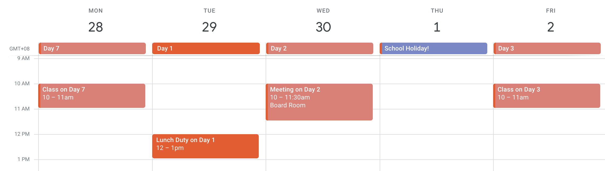
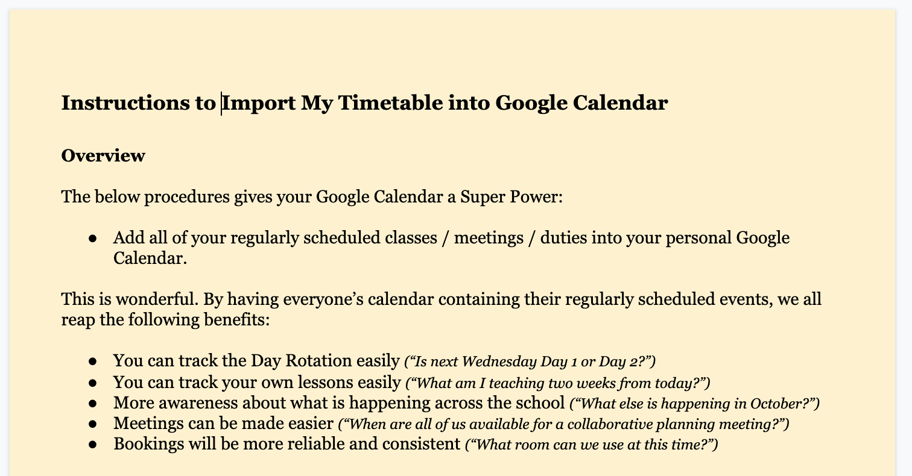

# Import My Timetable into Google Calendar

Shown below is a school calendar with a 7-day rotating timetable. Tuesday is Day 1, which means that Monday is Day 7 — the last day of the rotation. Wednesday is Day 2, but because Thursday is a school holiday, that means Friday is Day 3. Google Calendars don't have ability to create repeating events that follow this pattern:

For an N-day rotating timetable, how do teachers enter repeating events such as their classes, duties, and meetings?

In this solution, teachers enter their timetable info into a sheet, and then bring exported CSV into their Google Calendar. Particularly useful if you have a rotating timetable of more than five days and don't want to manually add them one by one.

Teachers will then get notifications when their classes arrive, or when they have duties, or anything else that in this day in age is useful to have a reminder about.

## Copyright

Released as Open Source software with an MIT license. Geeks may find the formulas intersting for this particular use case. 2018 [Classroom Tech Tools](https://classroomtechtools.com).

## HOWTO

The following are instructions for the tech administrator (coaches, etc) to get it working so that they can share with colleagues. Or for geeks who enjoy this sort of thing.

### Get the instruction manual

You'll need some instructions for the end user, on how to use the spreadsheet to enter the event data. Make a copy of [this Google Doc](https://docs.google.com/document/d/1ae_EKxj62Subj7x0YGSNMBN5I0Qs0Gsv5puYWxlq4LY/edit). You may want to modify the instructions, depending on whether or not you think it's clear enough!

### Get the Spreadsheet

Make a copy of [this spreadsheet](https://docs.google.com/spreadsheets/d/1BKcG9vKOajod9OUZN4MtTZlJYfilqj7cVPK_G5PBtdY/copy). Best practice would be to protect the Dates and Periods sheet as you'll have to share it out with teachers, and you don't want them fiddling with the settings.

### Adjust the date information to your Calendar

The Dates tab has a few settings that you can adjust. For holidays, simply overwrite your info. For example, if you have a three-day holiday including on `1/21/2019` (a Monday) and school re-opens on Tuesday, overwrite with it with the date `1/22/2019`. If the rotation schedule has some exceptions — for example maybe you have two Day 2s in a row, or something (schools can have complicated needs) — you can also overwrite in the same manner as you did the date.

### Adjust the Periods tab

Every school has a different period schedule, and so enter it there. Note that columns A and B need to be sorted in order for the other columns to work (there's a `VLOOKUP` with `true` for the fourth `is_sorted` parameter). Also note that if you need more than 20 rows to input Period information, you're going to have to adjust the Data Validation for Column B in the `Enter Timetable` tab.

### Share it out with Teachers, who then enter their timetable data

Teachers fill out the `Enter Timetable` with everything in their schedule just once, and the spreadsheet will produce the information needed for Google Calendar to import them as if they are repeating events (but they aren't, they're individual ones).

### Export as CSV, import into Google

Teachers export the contents of the `Export` tab and bring it into their timetable by using the import CSV feature. Best practice is to ask them to create a Test calendar and importing on that one first. This way, it gives them a chance to check out the result and if there is a mistake they can adjust in the spreadsheet and try again. Finally, import the CSV into their actual calendar (the one with their name) for it to become live.

## Known limitations

It only creates events where the end user is added to the event. It's not possible (currently) to add events with this, that adds many indiviuals.
